## Chef Delivery

App criado no curso da Alura [Construa aplicativos iOS com SwiftUI]([url](https://cursos.alura.com.br/formacao-ios-swiftui))

## Principais features

- Criação de interfaces com SwiftUI
- HStacks, VStacks, GeometryReader
- Animations
- Botão customizado com ***DragGesture***
- Chamando APIs de back end com ***URLSession*** e ___Alamofire___
- Uso do [Apiary](https://apiary.io/) da Oracle para documentação e mock de contrato de API backend

## Screenshots

### Light theme

 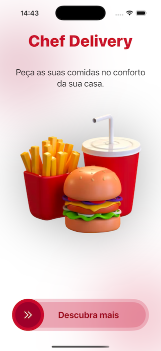    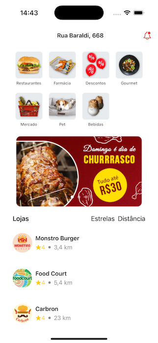  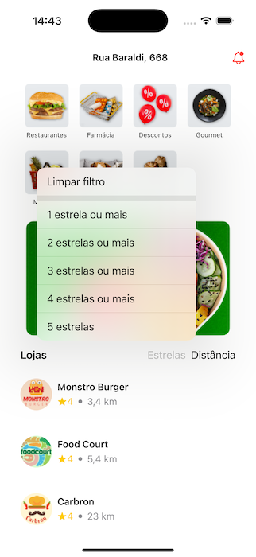  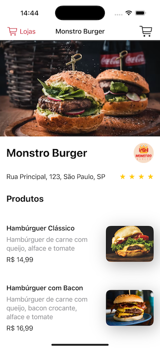  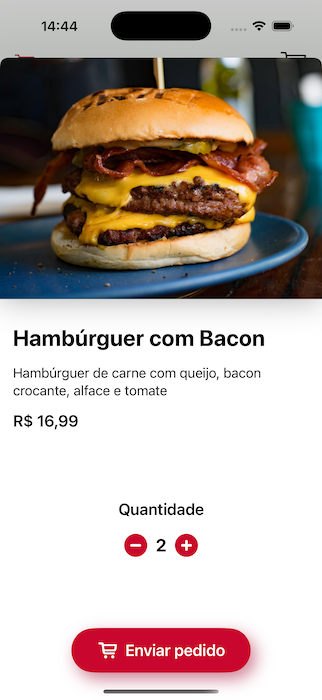  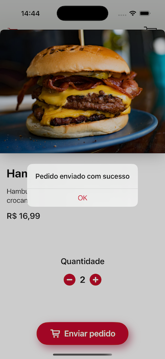 
 
### Dark theme

 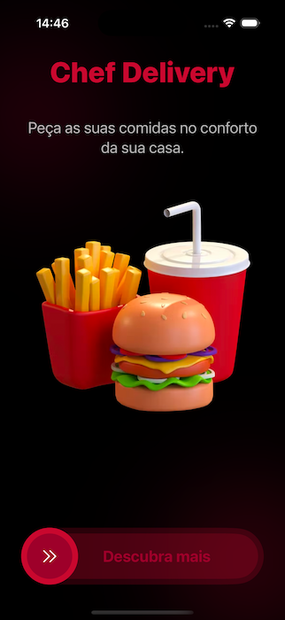  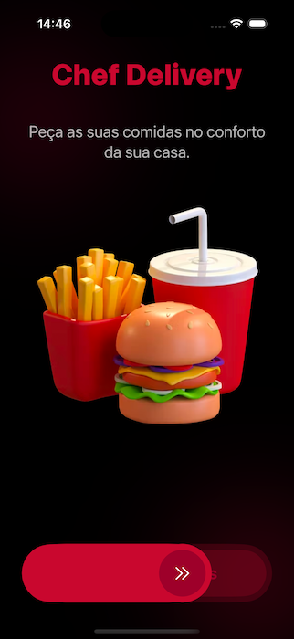  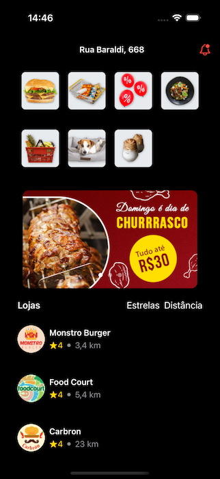  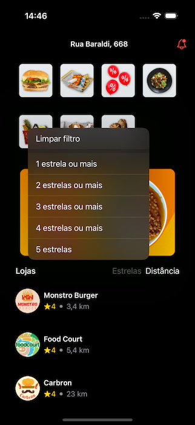  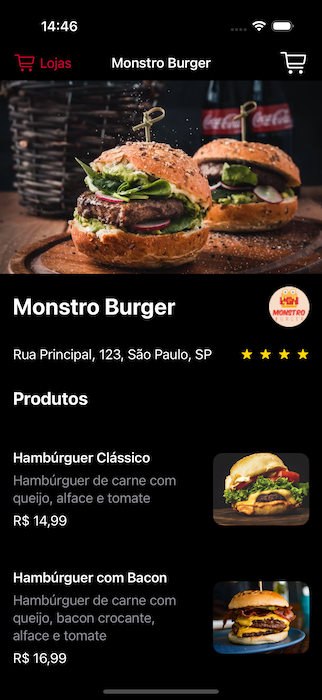  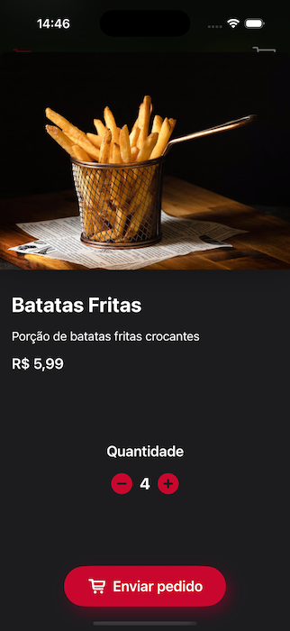  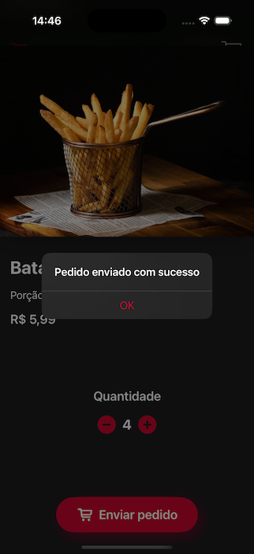 

