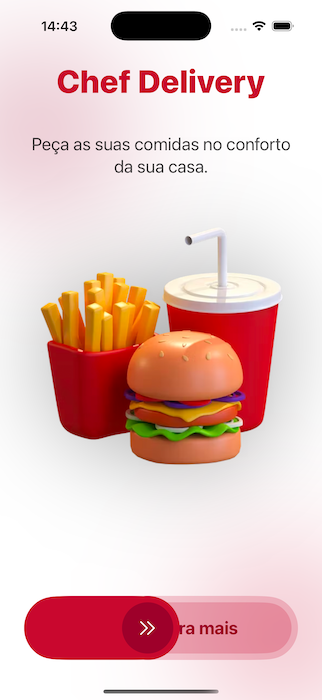

## Chef Delivery

App criado no curso da Alura sobre SwiftUI

## Principais features

- Criação de interfaces com SwiftUI
- HStacks, VStacks, GeometryReader
- Animations
- Botão customizado com ***DragGesture***
- Chamando APIs de back end com ***URLSession*** e ___Alamofire___
- Uso do [Apiary](https://apiary.io/) da Oracle para documentação e mock de contrato de API backend

## Screenshots

### Light theme

              
 
### Dark theme

              

